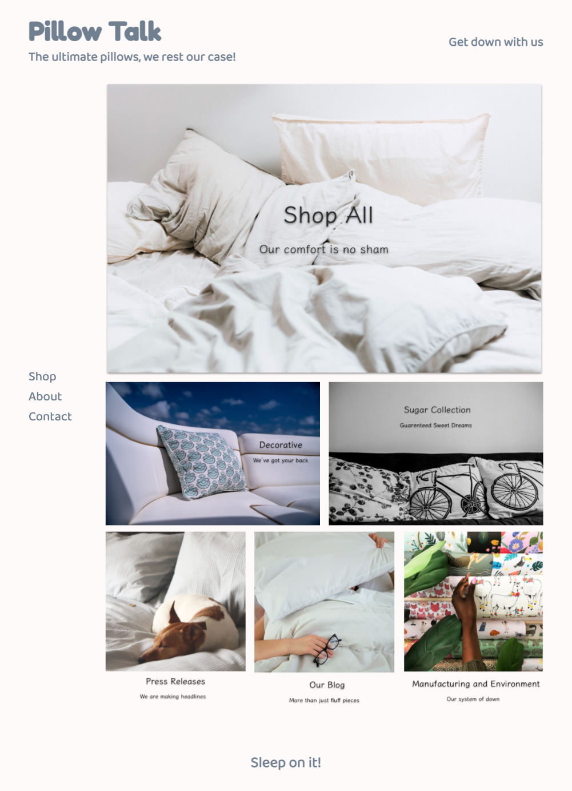
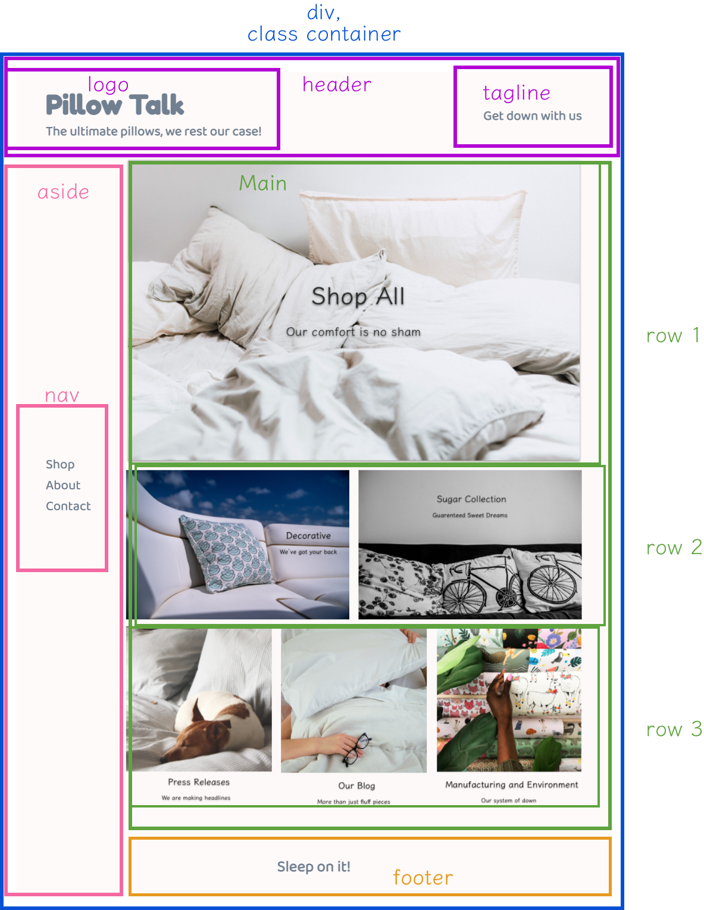
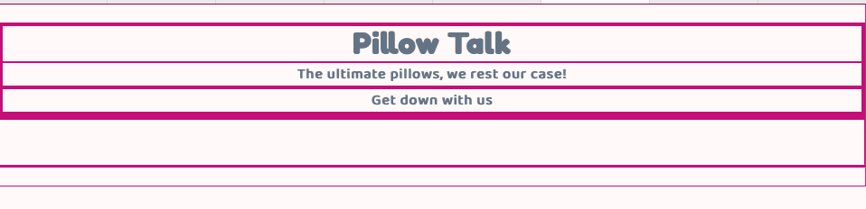
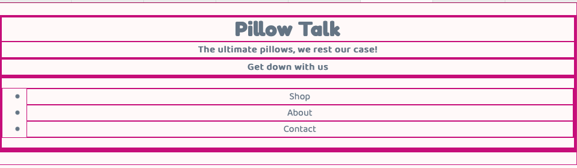
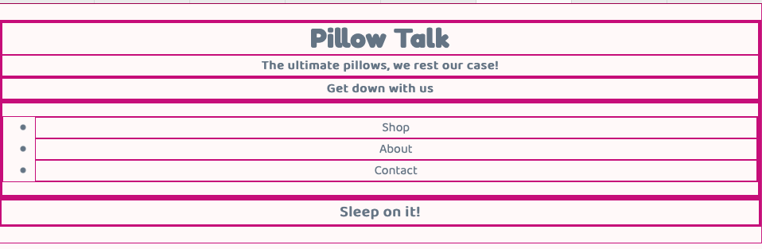
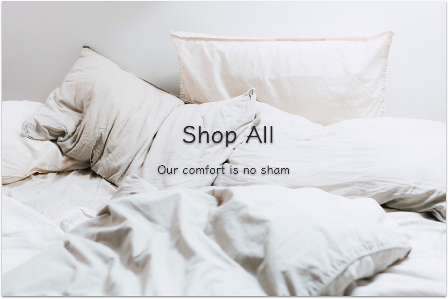
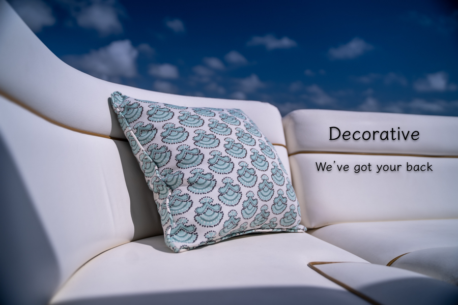
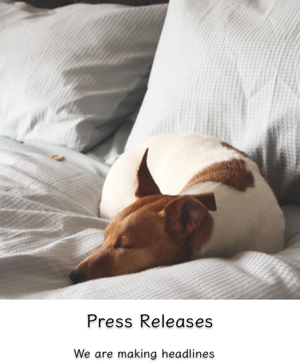
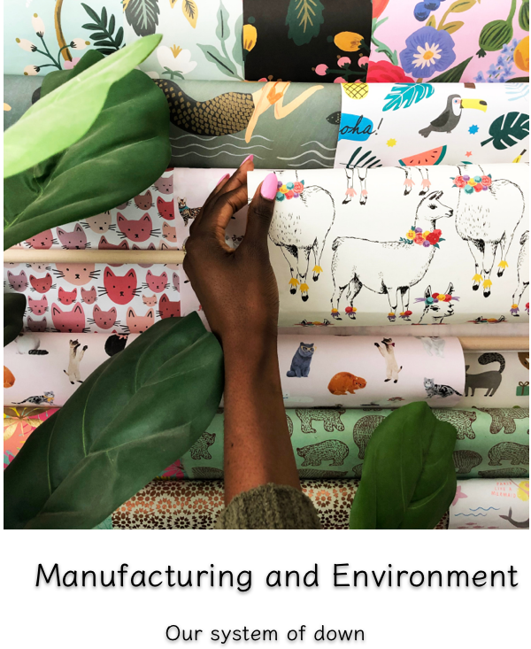
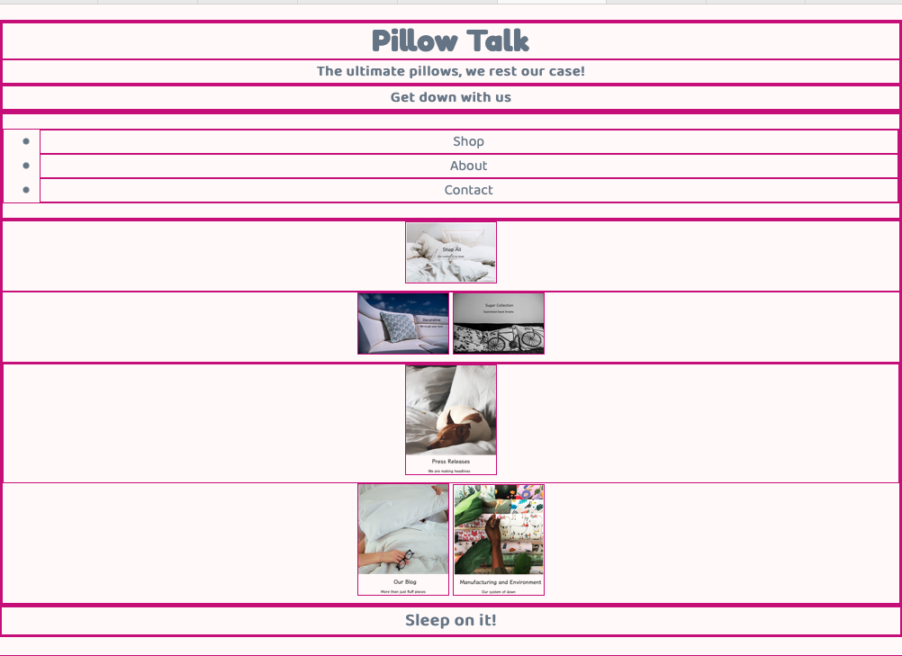

# Mockups to Code

## Part 1 Setup & HTML

A big and normal struggle is to take a mockup and turn it into a website.

Let's do it together.

This site is inspired by:  Hullo https://hullopillow.com 


## Start with our Mockup



## Determine our Components and the Elements they are Made Up of




## Start Coding

- `cd build`
- open `index.html` and `main.css` in your text editor
- open `index.html` in the browser, check that background color is set.

###### Important to Note

Our website will be going through an awkward phase. It won't look good with just HTML, but as long as we have a good structure and plan we will get it looking great!

## Add CSS Helpers and General styles

### CSS Helpers

### On the first line:

```CSS
@import url('https://fonts.googleapis.com/css2?family=Baloo+2&family=Fredoka+One&display=swap');
```

```CSS

/*********************************
* Build Helpers
*********************************/
/* give each element a border */
* {
  border: 1px solid mediumvioletred5;
}

/* shrink images for placement */
img {
  width: 100px;
}
```

```CSS
/*********************************
* General
*********************************/

body {
  background-color: snow;
  color: slategrey;
  margin: 20px 0;
  font-family: 'Baloo 2', cursive;
  text-align: center;
}

h1, h2, h3, h4, h5, h6 {
  margin: 0;
}

h2 {
  font-size: 1em;
}

h1 {
  font-family: 'Fredoka One', cursive;
}

```

## Add Outer Containers

In the body
 - `header`
 - `div` with a class of `container` in that div
  - `aside`
  - `main`
- `footer`

```html
<!DOCTYPE html>
<html lang="en" dir="ltr">
  <head>
    <meta charset="utf-8">
    <title>Pillow Talk</title>
    <link rel="shortcut icon" href="./assets/imgs/favicon.ico">
    <link rel="stylesheet" href="main.css">
  </head>
  <body>
    <header>

    </header>
    <div class="container">
      <aside class="">

      </aside>
      <main>

      </main>
    </div>
    <footer></footer>
  </body>
</html>
```

## Complete Header
insdie header tag
```html
<header>
  <div>
    <h1>Pillow Talk</h1>
    <h2>The ultimate pillows, we rest our case!</h2>
  </div>
  <div>
    <h2>Get down with us</h2>
  </div>
</header>
```

###### Appearance




## Complete Aside

```html
<aside>
  <nav>
    <ul>
      <li>Shop</li>
      <li>About</li>
      <li>Contact</li>
    </ul>
  </nav>
</aside>
```

###### Appearance




## Complete Footer

Outside and below the closing `div` with the class of `container`
```html
<footer>
  <h3> Sleep on it!</h3>
</footer>
```

###### Appearance




## Complete Main

### Main has more components

#### Firstly, make three 'rows' with `div`

```html
<main>
  <div class="top-row">

  </div>
  <div class="middle-row">

  </div>
  <div class="bottom-row">

  </div>
</main>
```
Remember, these divs have a height and width of 0 when there is nothing inside of them. So we might just see more top/bottom borders appear.

In the interest of time, rather than having cards with text, we are just going to have images that have all the components.

###### Images are from Unsplash.com


- <span>Photo by <a href="https://unsplash.com/@nate072107?utm_source=unsplash&amp;utm_medium=referral&amp;utm_content=creditCopyText">NATHAN MULLET</a> on <a href="https://unsplash.com/s/photos/pillow?utm_source=unsplash&amp;utm_medium=referral&amp;utm_content=creditCopyText">Unsplash</a></span>

- <span>Photo by <a href="https://unsplash.com/@priscilladupreez?utm_source=unsplash&amp;utm_medium=referral&amp;utm_content=creditCopyText">Priscilla Du Preez</a> on <a href="https://unsplash.com/s/photos/pillow?utm_source=unsplash&amp;utm_medium=referral&amp;utm_content=creditCopyText">Unsplash</a></span>

- <span>Photo by <a href="https://unsplash.com/@ymoran?utm_source=unsplash&amp;utm_medium=referral&amp;utm_content=creditCopyText">MORAN</a> on <a href="https://unsplash.com/s/photos/pillows?utm_source=unsplash&amp;utm_medium=referral&amp;utm_content=creditCopyText">Unsplash</a></span>

- <span>Photo by <a href="https://unsplash.com/@fauxeleven?utm_source=unsplash&amp;utm_medium=referral&amp;utm_content=creditCopyText">Lindsay Davison</a> on <a href="https://unsplash.com/s/photos/pillows?utm_source=unsplash&amp;utm_medium=referral&amp;utm_content=creditCopyText">Unsplash</a></span>

- <span>Photo by <a href="https://unsplash.com/@twinsfisch?utm_source=unsplash&amp;utm_medium=referral&amp;utm_content=creditCopyText">Isabella and Louisa Fischer</a> on <a href="https://unsplash.com/s/photos/pillows?utm_source=unsplash&amp;utm_medium=referral&amp;utm_content=creditCopyText">Unsplash</a></span>


### Top Row

```html
<div class="top-row">
  
</div>
```

The image is probably too big, let's shrink it for now

in `main.css`
```CSS
img {
  width: 100px;
}
```

### Middle Row

```html
<div class="middle-row">
  

    
</div>
```

### Bottom Row


```html
<div class="bottom-row">
  
  
  
</div>
```


###### Appearance




## Full HTML

```html
<!DOCTYPE html>
<html lang="en" dir="ltr">
  <head>
    <meta charset="utf-8">
    <title>Pillow Talk</title>
    <link rel="shortcut icon" href="./assets/imgs/favicon.ico">
    <link rel="stylesheet" href="main.css">
  </head>
  <body>
    <header>
      <div>
        <h1>Pillow Talk</h1>
        <h2>The ultimate pillows, we rest our case!</h2>
      </div>
      <div>
        <h2>Get down with us</h2>
      </div>
    </header>
    <div class="container">
      <aside>
        <nav>
          <ul>
            <li>Shop</li>
            <li>About</li>
            <li>Contact</li>
          </ul>
        </nav>
      </aside>
      <main>
        <div class="top-row">
            
        </div>
        <div class="middle-row">
          
          
        </div>
        <div class="bottom-row">
          
          
          
        </div>
      </main>
    </div>
    <footer>
      <h3> Sleep on it!</h3>
    </footer>
  </body>
</html>

```
